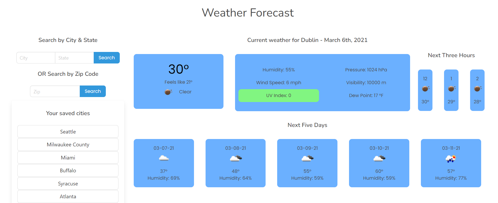

# Weather Dashboard

For this assignment, I was tasked with creating a weather dashboard from scratch that met the following requirements:

- User inputs to search by city and zip code
- User inputs sent to local storage and stored in buttons to recall previous searches
- Weather data for each city including: weather icon, temperature, humidity, wind speed, and UV index
- The UV index will indicate with a color scale the strength of the UV alert
- Each city must also show a 5-day forecast

## Skills Used

- HTML
- CSS
- Bulma
- JavaScript
- JQuery
- Moment.js
- Open Weather API

## App Preview

## Final Thoughts

The most challenging part of this project was setting up the search boxes and buttons that recall data already searched for. Since the Open Weather API uses lattitude and longitute to call weather data, I first had to use a geocoding API to get longitute and lattitude but using either city & state or zip code. After the search boxes were completed, the next challenge was populating the saved city buttons and making sure I didn't get duplicate buttons if someone searched for the same city twice. The final challenge was making sure I could navigate the data from the weather API and correctly populate it on the page. 

To take this project further I would add in the national weather alerts this API contains and add a button to toggle between Fahrenheight & Celsius. I would like to see this project implemented with a radar map and hourly data for the next 48 hours. 